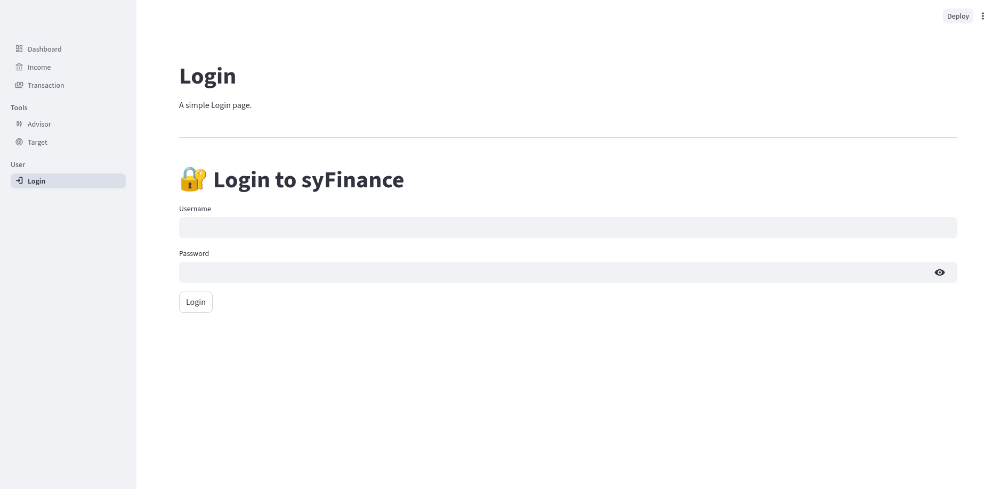
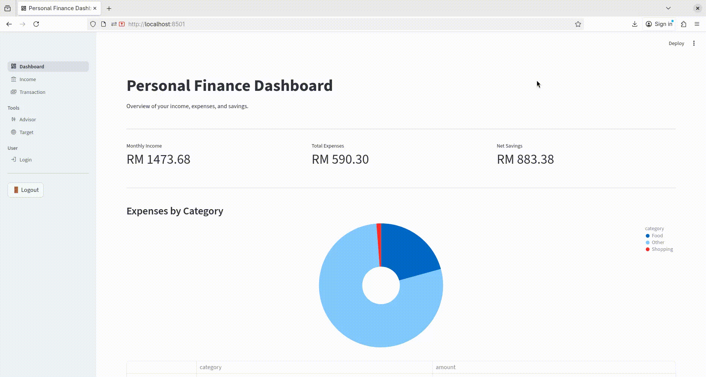

[](/LICENSE)


# A simple personal finance dashboard

This is a simple finance dashboard where user can monitor their transactions.
Good for looking over monthly budget.

---





---

# Before starting the app

There several thing need to be done before starting the app.

## Step 1: Install the dependencies

Option 1: Using `pip`

```bash
pip install -r requirements.txt
```

Option 2: Using UV (recommended)

```bash
uv sync
```

## Step 2: Initialize the database (IMPORTANT)

Now, you need to initialize the database. Don't worry, there already helper command for this. Just run:

```bash
python manage.py init_db
```

or if you are using `uv`

```bash
uv run manage.py init_db
```

Running this command will prompt you to create a user. After it is completed, now you are ready to start the app!

# How to RUN

To run the app is very simple! Just run:

```bash
streamlit run main.py 
```

or if you are using `uv`:

```bash
uv run streamlit run main.py
```

Upon executing the command, you will see the `Local URL` and `Network URL`. Open them in your browser. And yes, if you have other device that connected to the same network, you can copy the `Network URL` and paste it into the browser in that device to access the app.

> [!Note]
> If you are using linux just run `./run.sh` script to run the app.

---

## Dependencies

This project uses [Streamlit](https://streamlit.io), licensed under the Apache License 2.0.  
See [Streamlit License](https://github.com/streamlit/streamlit/blob/develop/LICENSE) for details.

This project also include [argon2-cffi](https://github.com/hynek/argon2-cffi), licensed under the MIT License.
See [argon2-cffi License](https://github.com/hynek/argon2-cffi?tab=MIT-1-ov-file) for details.


